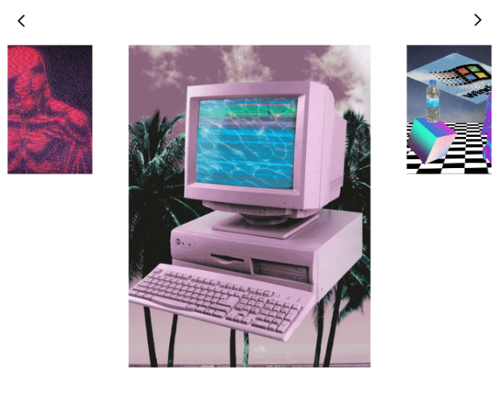

### 🖼️ Responsive React Carousel



#### 🤖 Usage

```
<ReactCarousel
    images={[
        ,
        ]}
    header={<div>header</div>}
/>
```

#### 🚀 Contribute

Contribute with your own code or ideas for improvements.

Fork the [Github repository](https://github.com/brigittarucz/react-carousel) and create a PR. Work in `src/lib` or `src/sass` and run a series of commands in order to start the React application and compile the .scss.

```npm install```
```npm start```
```npm run build:css```

Test before creating a PR through building it and integrating it into your project.

##### 🖥️ Happy hacking!
